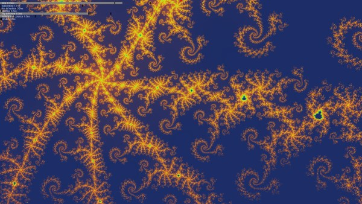
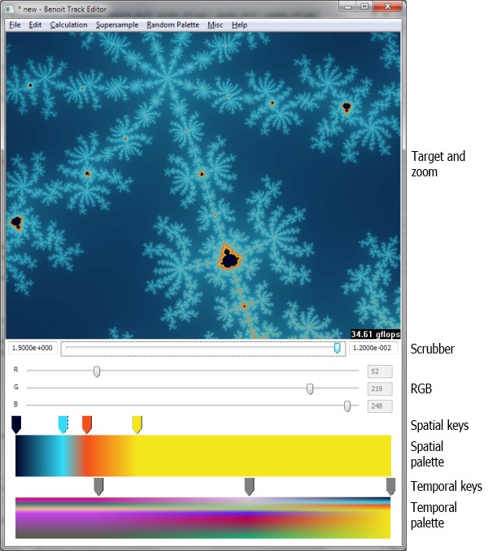
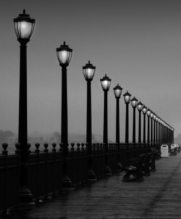
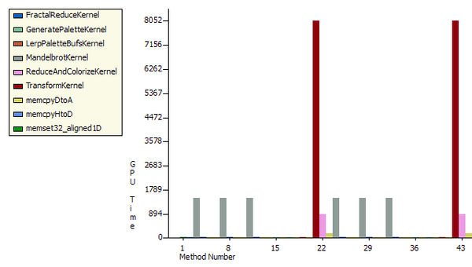
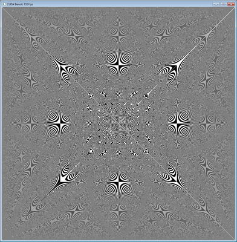

# CUDA Benoit

Realtime, high resolution, high iteration, supersampled, Mandelbrot fractal zoom using a novel calculation technique called a log scale map\_.

Log scale maps enable realtime rendering of fractal zooms of higher quality than what is possible using the traditional calculation methods implemented by almost all fractal zoom generators (including GPU based ones).

## Usage

This project consists of two apps, an editor and a player. Use the editor to create and edit fractal zoom specifications, called tracks, and then play them back in the player.

The player renders the tracks in realtime, creating a continuously running fractal zooming show. It comes with a set of completed tracks (courtesy of yours truly), so the editor is only needed if there is a desire to create custom tracks (which I hope people will take the time to do).

## Requirements

* A high end NVIDIA graphics card in the GTX 2xx or newer series.
* A 64 bit version of Windows.

Lower end workstation or embedded graphics cards (such as the ones used in laptops) will probably not be able to run this app satisfactorily.

### Benoit Player

The player reads fractal zoom specifications from .benoit track files created in the editor and renders them as colorful fractal zooms in realtime.



The player comes with a configuration file that has been optimized for an NVIDIA GTX 570 graphics card. If the target machine has this or a better card, tracks should play smoothly with good quality.

To start the player with the default tracks and default configuration, download the executable, uncompress it to a convenient location, such as the Desktop, and double click the player.exe file. For the best results, enable triple buffering in the NVIDIA Control Panel.

If you get error *CUDA driver version is insufficient for CUDA runtime version*, try updating your graphics card driver.

If you get error *The application has failed to start because its side-by-side configuration is incorrect*, double-click the included vcredist\_x64.exe file and follow the prompts. You only have to do this once.

If you get error *Not a valid Win32 application*, note that this app currently supports only 64 bit Windows. If you get this error on a 64 bit version of Windows, please let me know.

During playback, click to pause and right-click to view the log scale map. In the log scale map, all four sides of a fractal box are lined up on a single line.

If the target machine has a high end graphics card that is less powerful than a GTX 570, it may still be able to run the player with satisfactory rendering quality and frame rate by modifying the player's configuration file. See the configuration file\_ section for details on how to edit the file for optimal rendering quality on your machine.

If the target machine has a graphics card that is significantly faster than the GTX 570, it may be desirable to modify the player configuration to take advantage of the extra processing power. Again, refer to the configuration file section.

Note that the app can not take advantage of additional GPUs in a multi-GPU setup.

> **note**
>
> If you create a new configuration file, please send it to me together

> with the output from the included deviceQueryDrv.exe for your card. I would like to create a system that automatically selects the optimal configuration file for a given graphics card.

### Benoit Editor

The editor lets you create fractal zoom specifications, .benoit track files, to be rendered in realtime in the player.

A track contains a vanishing point to zoom towards, starting and ending zoom levels and key colors for creating palettes for frames in the zoom.



I created this tool because I feel that when coloring a fractal, the palette, in addition to providing colors, is an important tool for emphasizing and suppressing details in the fractal. So instead of just assigning palettes to fractals programmatically, I wanted a tool that would enable exact adjustment of the colors for given details in the fractals.

The basic idea behind the editor is to enable coloring of an entire fractal zoom by only specifying a few key colors. *Spatial and temporal palettes* are just my Star Trekian names for two simple concepts. A spatial palette is a palette for a single frame in the series of frames that make up a zoom. A temporal palette is the palette for an entire zoom.

A spatial palette is made up of one or more spatial keys. The spatial keys specify colors for specific escape times in a specific frame of the zoom. Colors for all the escape times in a frame are created automatically by interpolating between the given spatial keys.

Spatial palettes themselves are keys in the temporal palette. Each spatial palette key specifies the palette in one frame in the zoom. The entire temporal palette is made by interpolating between the temporal palette keys.

For instance, to create a track which starts out by using only gray tones and which, over time during the zoom, slowly shifts to using shades between red and green, create a temporal palette that contains two temporal keys. The first temporal key would be on the complete left (the location for the beginning of the zoom), and contain two spatial keys, one white and one black. The second temporal key would be on the complete right (the location for the end of the zoom), it would also contain two spatial keys, one red and one green.

#### How to use the editor

* To zoom into the fractal, click in the image. To zoom out, right-click. Both when left- and right clicking, the clicked position is used as the center for the new image.
* To change the zoom level between the highest and lowest zoom level that you have been at in the track, drag the scrubber. The numbers on the left and right sides of the scrubber indicate the highest and lowest zoom levels.
* The lowest zoom level is the level to which you have clicked. Zooming out decreases the lowest zoom level.
* To create a spatial key, click in the open area above the spatial palette. The key is created at that location and with a color that is the same as the interpolated color is in that position. This enables creating spatial keys that do not modify the current palette until their colors are adjusted. If a duplicate of an existing key is desired instead, focus the existing key by clicking on it, then select Edit | Duplicate spatial key.
* To delete a spatial key, right click it. The last spatial key can not be deleted.
* To create a temporal key, click in the open area above the temporal palette. The new temporal key is a copy of the closest existing temporal key, so this is also how temporal keys are copied.
* To delete a temporal key, right click it. The last temporal key can not be deleted.
* To modify a temporal key, give it focus by clicking it. Focus is shown as a thin dotted line around the key. When focus is set to a temporal key, the zoom scrubber is moved to match that location. This is so that when the temporal key is edited, the changes are shown in the frame for which the temporal key applies.
* To modify the color of a spatial key, give it focus by clicking it. Then drag the RGB sliders.
* To modify the positions of spatial and temporal keys, drag them.
* Press the numeric keys 1 to 9 on the keyboard to assign a randomly generated spatial palette to the currently focused temporal key. The spatial palette will have the same number of spatial keys as the number that was pressed. More colors create a fractal that looks more "busy". If the zoom scrubber is not at the location of the currently focused temporal key, it is moved there, and the fractal is updated accordingly. Usually, you will want to generate a palette for a new zoom level that you have arrived at by clicking in the fractal. To accomplish that, create a new temporal key or use an existing key and drag it all the way to the right (which is your current position if you have not moved the scrubber after right- or left clicking in the fractal), then press a key between 1 and 9.

    This function positions the spatial keys to evenly divide the colors between the calculated escape times, so it works best after the fractal has been fully rendered.

* Setting the calculation type in the Calculation menu and supersampling in the Supersample menu only affects how the fractal is calculated and rendered in the editor. It has no effect in the player.
* A higher bailout value enhances detail in the fractal. However, a higher bailout values also increases the fractal calculation time and makes it less likely that the player can rendered the track in realtime.

    All tracks that are to be played at the same time must use the same bailout value. If the bailout values do not match between tracks in a set, the player will select the lowest value and use it for all tracks.

* The editor can be associated with .benoit files, so that tracks can be opened for editing by double clicking them in Explorer. On Windows 7, right-click a .benoit file, select *Open With*, *Chose default program* and browse to the editor.exe file.

#### Example

The easiest way to create a track consists of these steps:

1.  Select File | New.
2.  Click in the fractal image to zoom. Keep clicking on interesting looking details until the resolution becomes bad. This takes around 20 clicks. If necessary, right click to back up. During this part, drag the black and white spatial keys if necessary to see details in the images.
3.  Drag the temporal key to the middle.
4.  Wait for the fractal to render for this position. Then press numeric keys between 2 and 9 on the keyboard until an interesting looking combination of colors appear.
5.  Drag the spatial keys to emphasize the details that you want to show and to suppress the details you want to hide.
6.  Create a copy of the temporal key by clicking next to it. Drag the new key most of the way to the left. Wait for the fractal to render.
7.  Drag the spatial keys to emphasize the details in this location. It is best to keep the relative positions of the keys the same, so that the colors are not swapping places during playback of the track.
8.  Create another copy of the center temporal key by clicking next to it. Drag this key most of the way to the right. Again, drag the keys to emphasize the details.
9.  Drag the scrubber to check what the fractal will look like in the interpolated areas. Modify existing temporal keys or create new ones if necessary.
10. Save the track in the player's tracks folder.

> **note**
>
> If you create new tracks, I would like to see them. I would

> also be interested in including the best ones with the player. If you do submit tracks, please include a note to the effect that the tracks are licensed under GPL and let me know which name and/or email address to credit the track to.

## Implementation

### Strategy

* Use a log scale map calculated in realtime.
* Do calculations with CUDA and rendering with OpenGL.
* Use CUDA to OpenGL interoperability to avoid transferring buffers between host and device.

### What is a log scale map?



This is a photo taken on a pier. Imagine that the pier was infinitely long. The point into which the walkway would seem to disappear in the distance is called the vanishing point.

The lamp posts are spaced evenly along the pier but as they get closer to the vanishing point, the number of pixels between each lamp post becomes lower. The number of pixels between each lamp post is a logarithmic function of how close to the vanishing point the lamp posts are.

To create an illusion of traveling towards the vanishing point in this image, progressively smaller sections of the image can be enlarged. However, because the resolution is the same across the entire image, the resolution will be reduced as the process is repeated, creating an image that is progressively more blurred.

If the lowered resolution is compensated for by distorting the image in such a way that the same number of pixels is stored between each lamp post regardless of how close the lamp post is to the vanishing point, a log scale map has been created. In other words, a log scale map is simply an image in which the resolution increases the closer the pixels are to the vanishing point.

With this log scale map, progressively smaller sections of the image can be enlarged around the vanishing point without the resolution becoming lower.

Translating this to the problem at hand, creating a realtime fractal zoom, the point towards which the zoom progresses becomes the vanishing point. It is in the exact center of the screen. As progressively smaller sections of the fractal image are rendered, new fractal image data is calculated for a portion of the fractal that is *inside* the vanishing point, where it can not yet be seen. However, the content is added with a resolution that is sufficient to display it at a good resolution even when it is displayed at the outer edges of the screen. In essence, the fractal data is reused at many different scales.

By using this technique, the problem of creating a realtime fractal zoom is shifted from being an issue of calculating fractal escape times fast enough, towards being more of a pixel manipulation issue, at which the graphics card happens to excel.

There is also an interesting synergy between the way this technique causes the fractal to be rendered and the way the human eye and brain works. Since the same fractal data is used at many different scales, the display resolution of the fractal data is higher the closer it is to the vanishing point in the center of the screen. When zooming into the fractal, the eyes and attention of the viewer are also naturally drawn towards the vanishing point, where new fractal detail emerges. The combined effect is that the imagery shows with the highest resolution where it gets the most attention. In addition, as fractal details become larger and start losing resolution, they move towards the outer edges of the screen and in the process, both move into the peripheral vision of the observer and pick up apparent speed -- both factors that help hide the fact that the resolution is becoming lower. The end result is that the fractal can be calculated in such a way that it provides fairly low detail towards the edges of the screen without the effect being readily noticeable by the viewer.

The main limitation of this technique is that the zoom can't change directions without creating an entirely new log scale map.

### Configuring the player

The player has a number of configuration settings, stored in the **player.cfg** file. The goal is to set these in such a way that the highest possible quality animation that your graphics card can generate is attained while maintaining the same framerate at which your monitor runs.

Example: Most LCD monitors run at 60 Hz. That gives the graphics card 16.7ms to calculate one frame. The player should be configured in such a way that each frame is rendered with the highest possible quality without the calculation taking longer than 16.7ms. If the calculation exceeds that number and triple buffering is not enabled in the NVIDIA Control Panel, a frame will be missed, causing a "stutter" in the animation. This stuttering is very visible due to the even movement of the animation, and it significantly detracts from the quality of the final presentation. If triple buffering has been enabled, stuttering will only occur when a delay equivalent to the rendering time for one frame has been accumulated over time.

The player can display timing information during playback to make configuration easier. See the **timers** setting below.

A setting can be set to its default value by prepending it with a hash mark ("\#").

> **warning**
>
> Only a few basic checks are performed on the parameters. In

> particular, it is not checked if the provided values are valid and/or will work together.

#### Settings

**timers**: Show timers for the various CUDA kernels that perform the calculations. The timers are rendered as horizontal bars. A red notch indicates the time available to calculate and render a single frame. Black marks indicate lowest, average and highest values for each timer.

It takes some time to render the timers themselves and by design, this rendering time is not included in the timers. This is so that the parameters can be fine tuned as if the timers were not being displayed (since the timers will not be displayed during regular playback). A result of this is that while the timers are being displayed, the player may be missing frames (causing stuttering) while still showing a *total* timer that is below the time limit designated by the red notch. In that case, the stuttering should go away when the timers are turned off for regular playback.

    timers = 0 # off (for regular playback)
    timers = 1 # on (for configuring the player)

**device**: The CUDA capable graphics card to use. If not specified or set to -1, the fastest card is automatically selected. "0" is the first card, "1" the second and so on.

    device = -1 # automatically select the fastest CUDA device

**vsync**: Synchronize drawing with the monitor refresh. Turning this on causes the track to run at an even pace and removes tearing. Tearing shows as horizontal discontinuities in the image, where two parts of the image don't quite match up.

When vsync is on, this app can benefit significantly from triple buffering. If there was a standard way to request triple buffering, this app would use that but, unfortunately, there isn't. To get triple buffering, enable it in the NVIDIA Control Panel. When enabled there, any OpenGL app that requests double buffering automatically gets triple buffering.

The advantage of triple buffering is that the calculations never have to wait. Say the app is able to calculate frames fast enough to render at 59 FPS and the monitor runs at 60 FPS. With double buffering, the actual frame rate will be 30 FPS. With triple buffering, the actual frame rate will be 59 FPS.

    vsync = 1 # on (highly recommended)
    vsync = 0 # off

**vsync interval**: Configure the frame rate to be a fraction of the monitor's refresh rate. This sets the frame rate to M/N where M is the monitor's refresh rate and N is the number set in this configuration setting. For instance, with a monitor running at 60FPS, setting this number to 3 causes a frame rate of 60/3FPS = 20FPS. The purpose of this setting is to enable rendering of tracks that are more complex (higher bailout value, higher supersampling values, etc) than the graphics card can handle at full frame rate, by reducing the frame rate.

Note: Graphics driver issues may cause this parameter to cause stuttering even when there are no missed frames (when set to a value other than 1).

    vsync_interval = 1

**fullscreen**: When turned on, the entire screen is used. If the screen width
and height\_ is not set to match the physical resolution of the screen, the track is stretched or compressed to match the screen.

    fullscreen = 1 # fill the screen with the track (recommended)
    fullscreen = 0 # show in window

**screen width and height**: Sets the display resolution of the track. It is recommended that these be set to match the physical resolution of the screen. Any resolution that is supported by the graphics card and monitor can be specified.

These settings can be used for playing back tracks in full screen with cards that would otherwise not be able to play them. For instance, if the screen resolution is 1920x1080, the workload can be reduced to a quarter by setting a resolution of 960x540. Of course, the result is a blurry image. It may be preferable to show the player in a window instead, by turning off the fullscreen\_ option.

    # 1920x1080 (16:9)
    screen_w = 1920
    screen_h = 1080

**zoom step**: Sets the difference in zoom level between each frame in the animation and thus the speed at which one is zooming into the fractal while the track is being rendered.

When a fractal is rendered in the traditional way, rendering speed and rendering resolution are closely related. The higher the resolution, the longer the rendering takes. When a fractal is rendered based on a log scale map, this speed vs. resolution trade-off is still present but exposed in a different way. Rendering speed becomes equivalent to rate of zoom. A higher rate of zoom then causes reduced resolution. However, the reduction in resolution is not uniform over the entire screen. Instead, the resolution is reduced along imaginary lines drawn from the center of the screen and towards its edges. A high zoom speed will cause low resolution that is most apparent towards the outer edges of the screen.

Since a track specifies a lowest zoom, this setting affects how long it takes to play back a track. A slow zoom will cause the track to take longer to play back (which also means that more frames are rendered for each track).

Other steps can be specified -- they are not limited to the provided examples. However, hardware limitations do impose boundaries on these values.

    zoom_step = 1.001   # very slow
    zoom_step = 1.0025  # slow
    zoom_step = 1.0075  # normal
    zoom_step = 1.01    # fast
    zoom_step = 1.1     # warp 10

**transform\_ss\_x and transform\_ss\_y**: Specify supersampling anti-aliasing (SSAA) parameters for the log scale transform. If these are set to values higher than 1, each pixel that is drawn on screen becomes the average of a higher number of actually calculated pixels. To get the number of calculated pixels per displayed pixel, multiply the two transform\_ss numbers. For instance, setting both values to 3 gives 9xSSAA.

3x3 gives significantly better quality than 2x2. It seems like the two odd numbers help reduce moire patterns created in the log scale transform.

Specify, together with the display resolution, how many fractal values that are calculated per frame.

Recommended (if your graphics card can handle it): 3x3

    transform_ss_x = 3
    transform_ss_y = 3

**fractal\_box\_ss**: Specify supersampling anti-aliasing (SSAA) parameters for the fractal boxes. This parameter specifies supersampling performed on the fractal escape times. Setting this to a value higher than 1 causes multiple escape times to be calculated and the values stored in the the fractal boxes become averages of these values. See the description for **boxes per frame** for more information on this parameter.

The cost of increasing this parameter may not be linear. For instance, with a screen size of 1920x1080, the size of a fractal box is 2 \* 1920 + 2 \* 1080 = 6000 escape times. This again causes 6000 threads to be launched on the GPU. A GTX 570 has 480 cores, which gives 12.5 threads per core. This is not enough to hide computational latency, even when the cores are running double precision calculations (see the single precision\_ setting). The result is that it may be possible to increase this value without any apparent cost. Unfortunately, the improvement in rendering quality is also fairly marginal.

In general, if it is found that fractal\_box\_ss does increase kernel time, it is better to add boxes per frame\_ than extra fractal box supersampling. The two options increase the number of required calculations in the same way. For instance, increasing fractal\_box\_ss from 1 to 2 doubles the number of Mandelbrot escape times that must be calculated, and so does increasing boxes per frame from 1 to 2.

    fractal_box_ss = 1

**boxes per frame**: The number of fractal boxes to calculate per frame. Primarily affects the apparent display resolution at the edges of the screen. When this number is increased above 1, the zooming speed is adjusted automatically to compensate. Recommended: As many as your graphics card can handle.

    boxes_per_frame = 3

**bailout**: A higher bailout value enhances detail in the fractal. However, a higher bailout values also increases the fractal calculation time and makes it less likely that the track can be rendered in realtime.

Setting this value overrides the bailout value that is embedded in the track itself and which was set by the person who created the track. Overriding the bailout value is not recommended because it causes a shift in the color ranges that will usually cause the details that the palette was designed to expose to no longer appear.

The main use for this parameter is to specify a bailout value that is lower than the ones recorded in the tracks if your graphics card is not fast enough to render the tracks with their original bailout values.

Normal range: 100 - 10000.

    # default: commented out (use the bailout values stored in the tracks)
    # bailout = 2000

**gray-scale**: When turned on, the temporal palette in a track is ignored and the track is rendered with a gray-scale palette.

    grayscale = 0 # off (recommended)
    grayscale = 1 # render tracks with gray-scale palette.

**single precision**: Calculate Mandelbrot fractal with single precision (32-bit) floating point only. This will reduce the "depth" to which a track can zoom to slightly less than half of that available when using the default double precision. The zoom depths of tracks are automatically adjusted to compensate.

    single_precision = 0 # off (recommended for Fermi )
    single_precision = 1 # on (recommended for Kepler, Maxwell and Pascal)

In general:

    Fermi: GTX 4xx / 5xx
    Kepler: GTX 6xx
    Maxwell: GTX 7xx, 9xx
    Pascal: GTX 9xx, 10xx

It's necessary to use single precision on the later architectures because they have fewer double precision floating point ALUs.

#### Interaction between parameters

The following formulas show how the configuration parameters interact to cause the given workload performed by the GPU.

Mandelbrot escape values calculated per frame:

    (2 * screen_w * transform_ss_x + 2 * screen_h * transform_ss_y) *
    boxes_per_frame * fractal_box_ss

Log scale transformations calculated per frame:

    screen_w * transform_ss_x * screen_h * transform_ss_y

## Implementation notes for the player

The source code for the player is \~2000 lines of well documented C++ and CUDA C. An effort has been made to make the code readable. I am happy to answer any questions about the code.

### Performance

This figure shows kernel execution times in microseconds for two frames rendered in the player with 1920x1080 display resolution, 9xSSAA (supersampling), bailout 2000, 3 fractal boxes per frame and escape times calculated with double precision. As can be observed, the transform takes \~8000us, which is half of the available time when rendering at 60 FPS. Each of the fractal boxes take \~1400us, 4200us total. Leaving around 4400us for the other kernels, overhead and safety margin, to meet the 60 FPS deadline.



The two main tasks performed by the player, Mandelbrot escape time calculations and log scale transforms are both tasks to which the graphics card is ideally suited. Both consist of large blocks of calculations that are completely independent of each other and which access memory consecutively. Also, there is no need for further processing of the data by the CPU so CUDA to OpenGL interop is used to display the rendered data without it leaving the graphics card.

Performance is good on the GTX 570. In the log scale transform kernel, instruction throughput is 1.6 instructions per clock out of a possible 2.0 (82%) and active warps is 41 of 48 (85%). One of of the instructions in the kernel is a log(), traditionally a very slow instruction. Though, even though the card is running the kernel at a rate that is close to theoretical maximum, there is performance to be gained by reducing the number of operations in the kernel in the following ways:

* Factor the 4-way section selection code out of the transform kernel and, on Fermi (GTX 4xx), run 4 kernels at the same time by using the new ability to keep multiple kernels in flight at the same time.
* Thread counts are low in the escape time calculations. When calculating multiple boxes per frame or supersampling escape times, those kernels could be run concurrently on Fermi, which should allow better device utilization.
* The supersampling used in the log scale transform is implemented in a simplistic way. The transform kernel writes unreduced data out to global memory and a second kernel reads that data in, reduces it and writes it back out. This should be combined to a single kernel that performs the reduction using shared memory. Also, the kernel that reduces the data uses one thread per reduced value instead of one thread per unreduced value.

### Building on Linux

```
$ sudo apt install libglew-dev libboost-dev wx3.0-headers libwxgtk3.0-dev

$ git clone <copy/paste the clone link from the green button on top of this page>
$ cd cuda-benoit
$ mkdir cmake-build-release
$ cd cmake-build-release
$ cmake -DCMAKE_BUILD_TYPE=Release ..
$ make
```

### Known issues

#### Moiré pattern



The main factor that reduces rendering quality in the player is a Moiré pattern that is visible when rendering certain combinations of fractal data and palettes. The pattern is created in the log scale transform and I *think* it's caused by an inaccurate (but very fast) implementation of `log` on the GPU.

 Using supersampling in the transform (an option that is available in the player and enabled by default) helps but does not completely remove the Moiré pattern. The app uses linear interpolation when sampling from the fractal box buffer, where the base data for the log scale transform resides.

By filling the fractal box buffer with sample data, alternating black and white pixels, the Moiré pattern is fully exposed, causing a display as shown. When rendering a regular track, the Moiré pattern appears "blended in" with the fractal image when it is visible.

As can be seen in the image, when the Moiré pattern is visible, it is most apparent in areas radiating out from the center in 90 and 45 degree angles.


#### CUDA / OpenGL interoperability performance

This app uses the CUDA / OpenGL interoperability functionality that was introduced in CUDA 3.0. I have found that when there are two GPUs installed in the machine, the speed of the interoperability falls dramatically, presumably because the driver starts copying the objects that are shared between CUDA and OpenGL back and forth between host and device.

This is true even if the second card does not have any monitors attached and is assigned to PhysX.

Hopefully, this issue will be resolved in future drivers.

#### Track rendering

Care has been taken to make tracks render in the player just as they appear when they are being created in the editor. There are however a few factors which may alter the exact visual match between the two.

* In the editor, the fractal is rendered with uniform resolution across the entire image. In the player, the resolution diminishes towards the outer edges of the screen.
* During playback, palettes for different tracks fade into each other during the transitions between tracks to avoid abrupt color changes. This causes the colors to not appear correctly for a given track during its first and last part. Note that the when the player is first launched, the starting palette for the first track includes a fade in of the ending palette for the last track, just as if the player had cycled through all the tracks already.
* The full Mandelbrot set has a large area in the center where the escape times all go to the bailout value. To lessen the chance of missed frames when rendering the initial part of a track, the zoom level is automatically adjusted if the track starts by showing a big part of the full Mandelbrot set.
* If the single precision option is turned on, the final part of a track is not rendered if it requires double precision.
* If a track specifies an ending zoom level that can not be rendered with double precision floating point, that part is automatically skipped.

## Implementation notes for the editor

The source code for the editor is \~4400 lines of fairly well documented C++. An effort has been made to make the code readable. I am happy to answer any questions about the code.

### Performance

Performance is not very important in the editor. It just needs to be sufficient to provide fairly painless editing of tracks. However, I took the opportunity to roll in a few different Mandelbrot calculation methods that I had available from earlier projects and the app displays the number of gigaflops attained while running the calculations, so that some benchmarking can be done.

There is also the side effect that the computer on which tracks are created and edited does not have to be CUDA capable (as opposed to the computer on which the tracks are played).

The Mandelbrot escape time calculation methods included are:

**x86 32 bit float and x86 64/80 bit double**: Straight forward implementation written in C++, templatized on the floating point type.

**SSE2, 4x32 bit floats, C++ with intrinsics**: This implementation was written by Bjørn Bæverfjord, [www.sciencezero.org](http://www.sciencezero.org). It calculates 4 escape times simultaneously using packed floats. It is implemented using SSE2 intrinsics in C++.

**SSE2, 2x64 bit doubles, x64 assembly**: This implementation calculates 2 escape times simultaneously using packed doubles in SSE2. It is implemented in x64 assembly. It is part of an earlier project where I researched how to write x64 and integrate it with C++ in Visual C++. As part of that project, I also wrote a [brief x64 assembly tutorial](http://www.sciencezero.org/index.php?title=How_to_write_x64_assembly_functions_in_Visual_C%2B%2B).

**CUDA 32 bit float and CUDA 64 bit float**: Straight forward calculation written in CUDA C, templatized on the floating point type.

The CPU implementations were all parallelized using OpenMP.

An interesting observation that can be made from viewing the different implementations is the big difference in level of complexity between the CUDA and the SSE implementations. The SSE implementations had to be written in assembly (or by using assembly intrinsics). The fact that the number of iterations in the loop vary for each escape time calculation has to be handled manually by masking techniques. In addition, the loop must be bracketed by code that first packs the starting values into XMM registers and unpacks the results afterwards. In contrast, the CUDA implementation of the escape time calculation loop looks like the plain C++ implementation. In other words, not only does the CUDA implementation of the Mandelbrot escape time calculation run much faster (see Benchmark\_), it also saved a lot of developer time.

#### Benchmarks

Characteristic of the Mandelbrot escape time calculation: The calculation is always purely compute bound. The loop consists of 14 floating point operations, a branch and an integer subtraction and test for zero. In this test, the loop was run 10,000 times for approximately 24,000,000 values. There is almost no I/O. Input is 2 floating point values, output is one integer value.

The editor was set up with 25xSSAA, bailout was set to 10,000 and the window was maximized. A zoom was then performed into the center of the Mandelbrot set, where all escape times hit the bailout value.

##### 2x4 core NUMA Intel Xeon E5504 "Gainestown" @ 2.0GHz / GTX 570 @ 1.5GHz

    x86 double     13 gflops
    x86 float      14 gflops
    SSE2 double    22 gflops
    SSE2 float     56 gflops
    CUDA double   137 gflops
    CUDA float    528 gflops

##### 8 core AMD Ryzen 1700 @ 3.0GHz / GTX 1070 @ 1.8GHz

    x86 double     34 gflops
    x86 float      34 gflops
    SSE2 double
    SSE2 float
    CUDA double   167 gflops
    CUDA float   3485 gflops

As mentioned earlier, the CPU implementations were parallelized using OpenMP, so the CPU implementations use all available cores. Calculations were verified to scale linearly with core count. This was expected as the calculations are compute bound and have no interdependencies.

Observations:

* Single precision on GTX 570 at 1.5GHz is 9x faster than 8 Gainestown cores at 2.0GHz. It would be 19x faster on a similar quad core machine.
* Similarly, double precision is 6x faster.
* The difference between single and double precision on CUDA is only 4x even though the Fermi GF110 chip on the GTX 570 card has been artificially limited to double precision floating point performance 1/8th that of single precision. This indicates that the single precision implementation can be improved.
* Also relevant is the performance difference between x86 float and CUDA float, where CUDA float is 38x faster (75x on a quad core machine). This comparison is relevant because it compares two implementations in which about the same amount of developer effort was put.

### Known issues

#### Saving images

Saving images is not supported. There are many, many, *many* apps out there that are far superior for generating static fractal images. However, a possible workaround is to configure the player for very high rendering quality (no longer realtime), and then use *print screen* to take a snapshot at the right moment. Another alternative is to save the track, open the .benoit file in a text editor, read out the center\_r and center\_i values, plug those into another app and use them for finding the area.

### Misc

* The track files (.benoit) are XML files. They can be opened and edited in a text editor.
* The basic formula for the log scale transform is:

    $$samplepos = \frac{log(\frac{1}{zoomend})}{log(zoomstep)}$$

    Solving for zoomend:

    $$zoomend = e^{- samplepos * log(zoomstep)}$$

## TODO

* Automatically adjust the interpolated spatial palettes so that they slice in the same way as the keys.
* Store normalized escape times in the fractal boxes.
* Look at the "parallel reduction" and "threadFenceReduction" SDK examples for information on how to do the supersampling in a single kernel. Also read the whitepaper for reduction.
* It's possible to minimize the difference in rendered result when bailout is forced to a lower value than what's in the track by scaling the color range like it would be scaled for the original value. For bailout that is forced to a higher value, there are no colors, but the best option would probably be to just mirror back.

## Image credit

The image used in What is a log scale map?\_ is part of photo called *Embarcadero Pier, San Francisco 2005*. It was taken by Chris Gulker.
